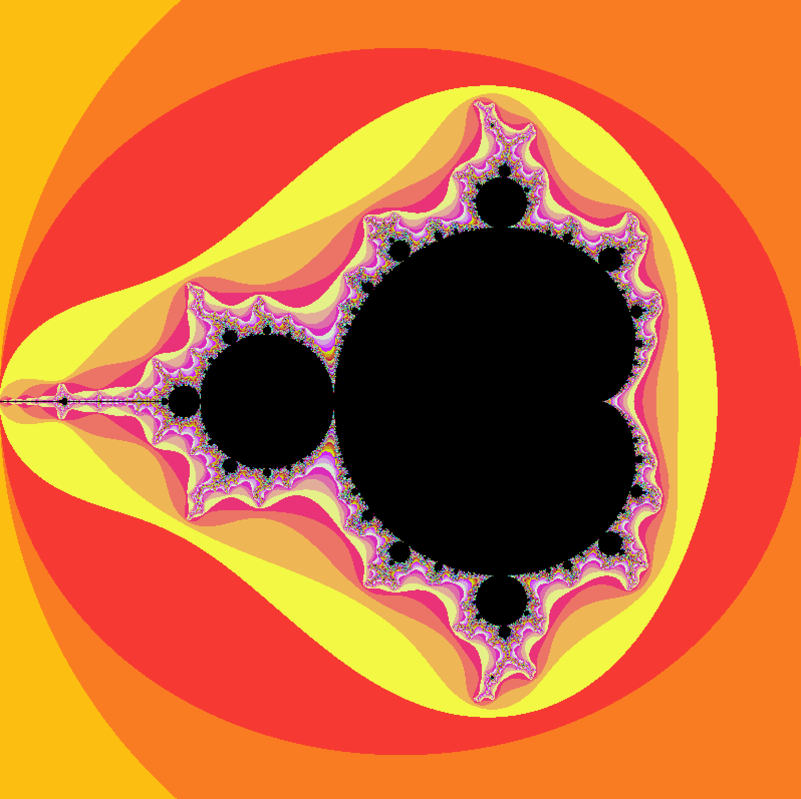
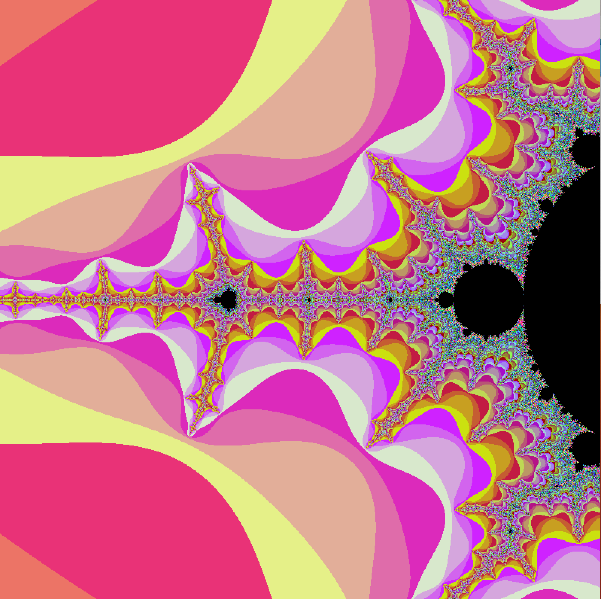
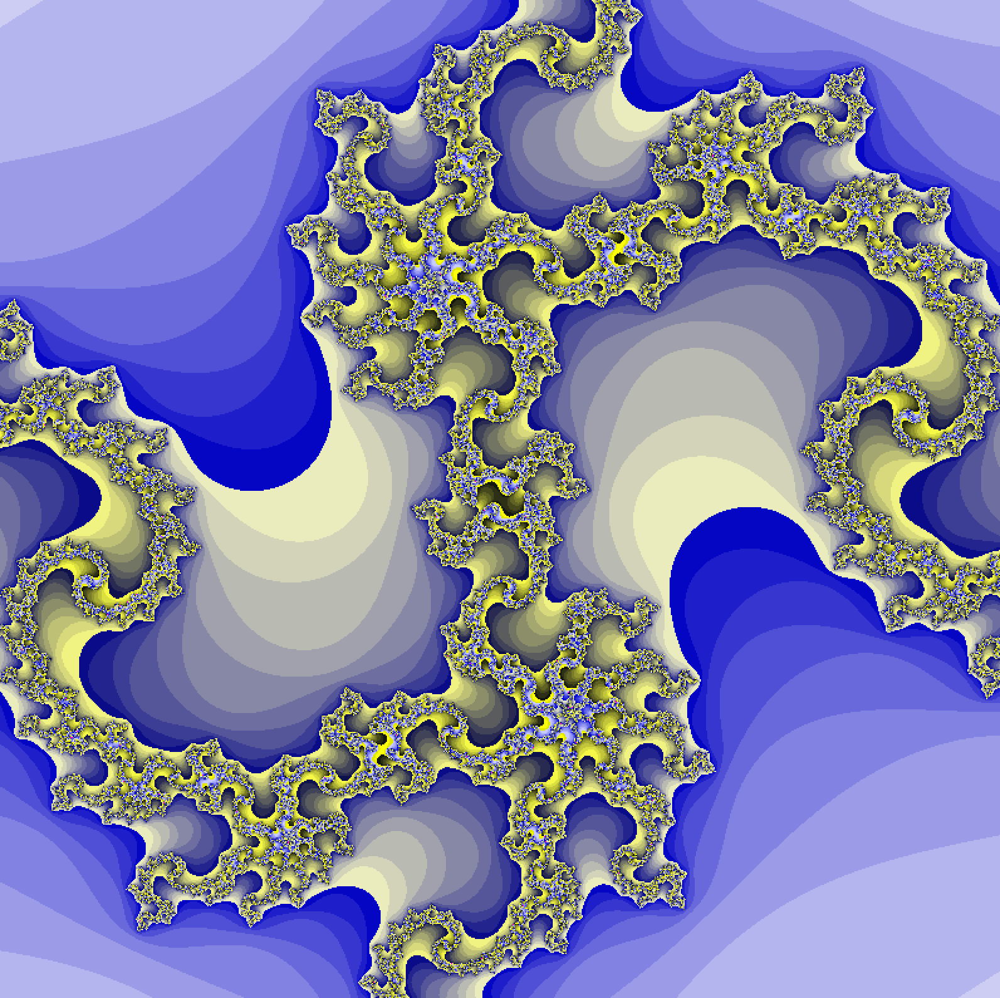
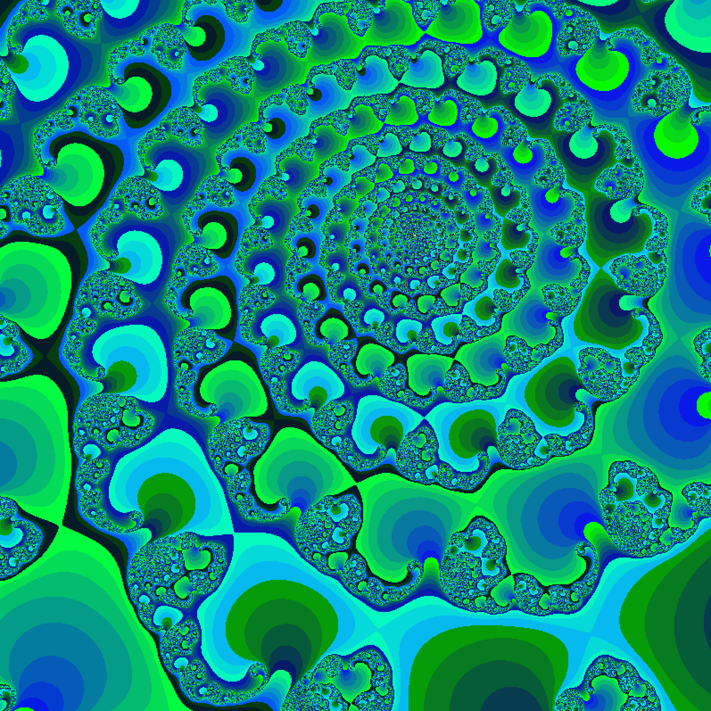
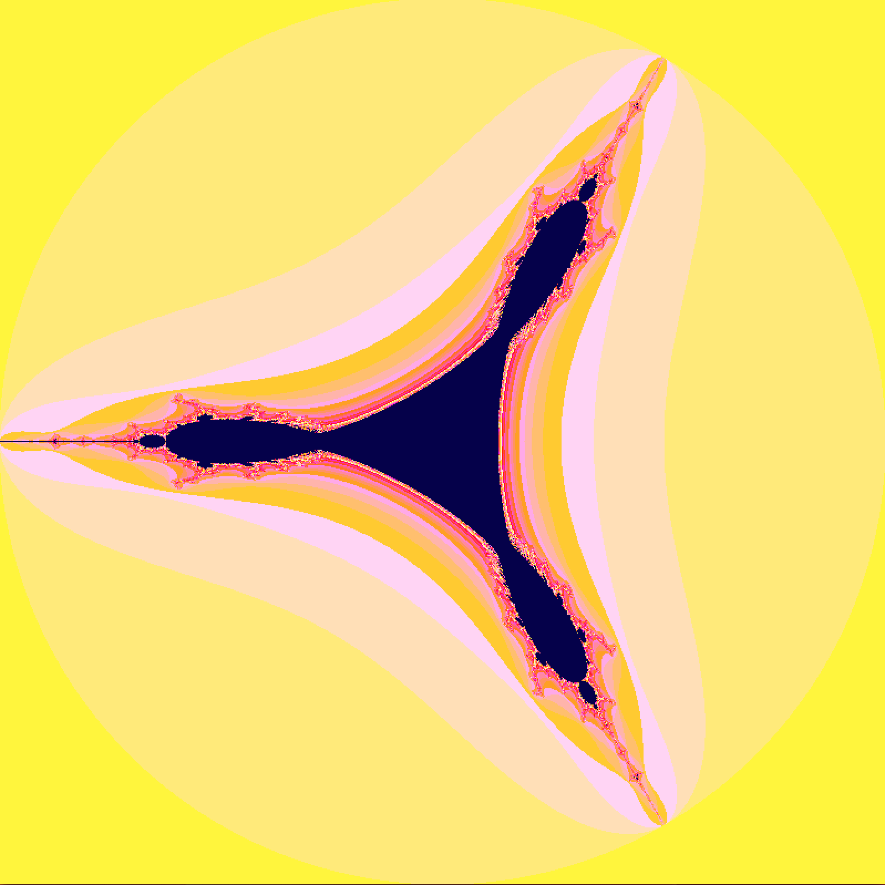
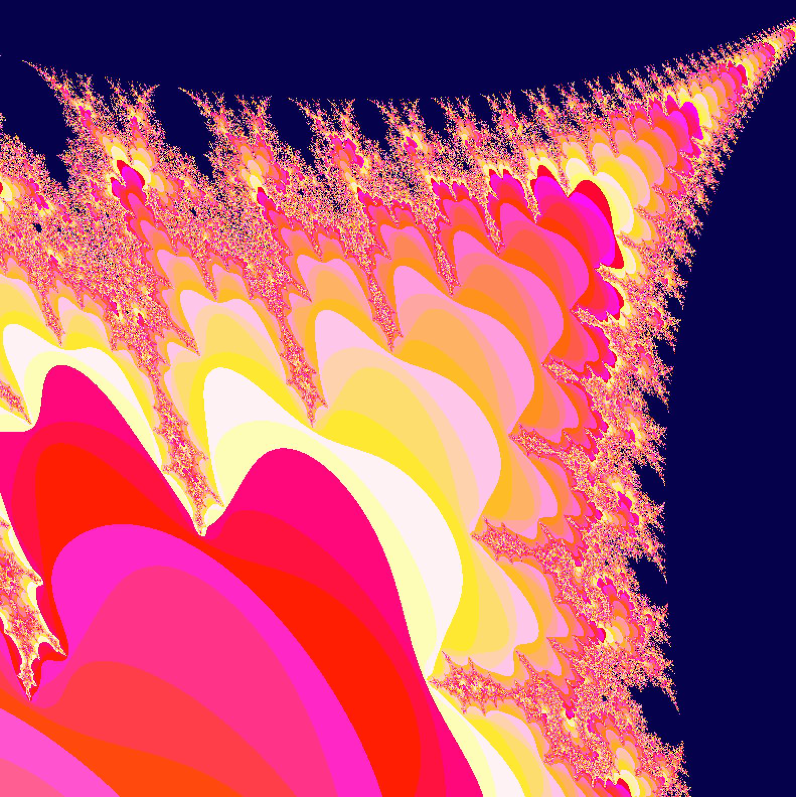

# fract'ol

A fractal renderer built in C as part of the 42 school curriculum. Renders the Mandelbrot, Julia, and Tricorn sets on an 800×800 window using MiniLibX. Supports real-time zooming, panning, and color cycling — all driven by keyboard and mouse events.

---

## Screenshots

### Mandelbrot

| Default view | Zoomed in |
|:---:|:---:|
|  |  |

### Julia

| Default (`c = -0.835 - 0.2321i`) | Custom (`c = 0.285 + 0.01i`) |
|:---:|:---:|
|  |  |

### Tricorn

| Default view | Zoomed in |
|:---:|:---:|
|  |  |

---

## Build & Run

**Dependencies:** X11 and Xext (Linux) or the Cocoa/OpenGL frameworks (macOS — handled automatically).

```bash
# Clone with submodules (minilibx and libft are vendored)
git clone https://github.com/miguandr/fract_ol.git
cd fract_ol

# Build everything
make

# Run
./fractol mandelbrot
./fractol julia
./fractol julia 0.285 0.01   # custom Julia constant
./fractol tricorn
```

### Makefile targets

| Target   | Description                                      |
|----------|--------------------------------------------------|
| `all`    | Build MiniLibX, libft, and the `fractol` binary  |
| `clean`  | Remove object files (`obj/`) from all components |
| `fclean` | `clean` + remove `fractol` binary and `libft.a`  |
| `re`     | `fclean` then `all`                              |

---

## Fractals

### Mandelbrot

```bash
./fractol mandelbrot
# or shorthand
./fractol 1
```

Classic Mandelbrot set. Iterates `z = z² + c` from `z = 0`, where `c` is each point in the complex plane. The viewport is centered at (-0.5, 0) with a width of 3.0 units.

### Julia

```bash
./fractol julia
./fractol julia <real> <imag>   # both values must be in [-2.0, 2.0] and contain a '.'
```

Julia set. Same iteration formula as Mandelbrot, but `z` starts at each pixel's complex coordinate and `c` is a fixed constant. Without arguments, defaults to `c = -0.835 - 0.2321i`. With arguments, you specify the constant — values must be floats in `[-2.0, 2.0]`.

### Tricorn

```bash
./fractol tricorn
# or shorthand
./fractol 3
```

Tricorn (a.k.a. Mandelbar). Like Mandelbrot, but uses the conjugate of `z` in each iteration: `z = conj(z)² + c`. This produces a three-fold symmetry instead of the usual two-fold.

---

## Controls

| Input               | Action                              |
|---------------------|-------------------------------------|
| Arrow keys          | Pan the view (20% of viewport/step) |
| `+` / `-`           | Zoom in / zoom out                  |
| Mouse scroll up     | Zoom in                             |
| Mouse scroll down   | Zoom out                            |
| `c`                 | Cycle through 4 color palettes      |
| `Spacebar`          | Cycle to the next fractal set       |
| `ESC` / close window | Quit                               |

---

## Architecture

The codebase is split into focused files with a single top-level struct (`t_fractal`) passed by pointer throughout:

```
sources/
├── main.c          — argument parsing, fractal type selection, program entry
├── init.c          — MLX setup, window/image creation, viewport layout
├── fractals.c      — the three iteration algorithms (Mandelbrot, Julia, Tricorn)
├── render.c        — pixel loop: maps screen coords to complex plane, calls fractal, writes color
├── event.c         — registers MLX hooks for keyboard and mouse
├── event_utils.c   — zoom, pan, color cycle, fractal switch logic
├── info.c          — usage message and control reference printed to stdout
└── utils.c         — clean shutdown (destroy image/window/display), error messaging

includes/
├── fractol.h       — structs (t_fractal, t_image), constants, all function prototypes
└── keys.h          — X11 keycodes and mouse button constants

libft/              — custom libc implementation (ft_printf, get_next_line, string utils, ft_atof)
minilibx/           — vendored MiniLibX (X11 window/event/image library from 42)
```

**Rendering pipeline:** for each frame, `fractal_render` maps every pixel `(x, y)` to a point `(pr, pi)` in the complex plane using the current viewport bounds (`min_r`, `max_r`, `min_i`, `max_i`). It calls the selected fractal's iteration function, gets a count back, and multiplies it by the current color multiplier to produce an RGB value. Points that reach `MAX_ITER` (400) without escaping get the background color (`color_main`).

**Zoom/pan:** both operations work by adjusting the four viewport boundary values (`min_r`, `max_r`, `min_i`, `max_i`) and re-rendering, using arithmetic on the complex plane bounds.

**Color cycling:** four hardcoded palettes, cycled by incrementing `color_set`. Each palette is a base color multiplied by the iteration count, so the gradient emerges naturally from the math.

---

## Notes

- Window is fixed at 800×800 pixels (`WIDTH`/`HEIGHT` in [fractol.h](includes/fractol.h)).
- Max iterations is fixed at 400 (`MAX_ITER`). Lower = faster but less detail; higher = more detail at deep zoom.
- The project was built and tested on Linux (X11). The Makefile switches link flags automatically for macOS (XQuartz/X11), but MiniLibX behavior may differ.
- Warnings during `make` come from MiniLibX internals (42's vendored X11 library, written in C89). The project source compiles clean.
